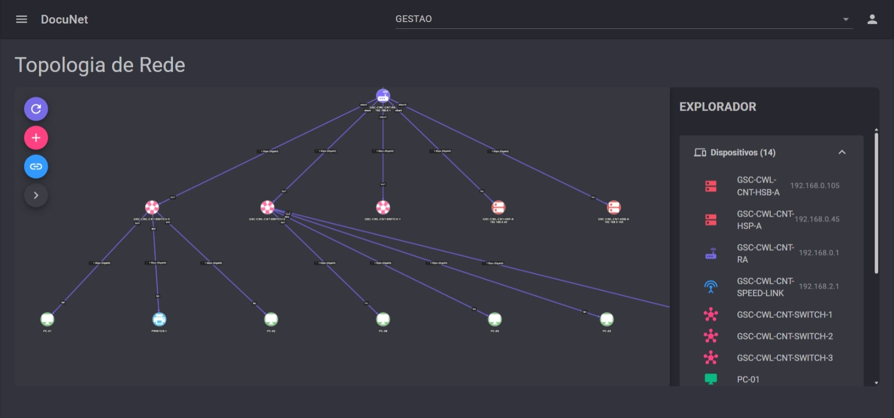
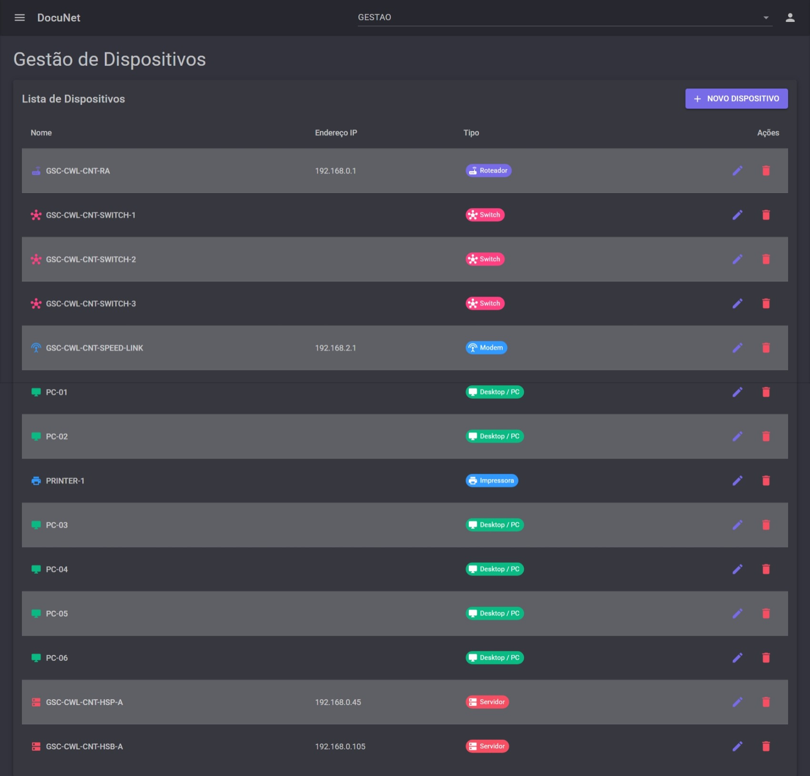
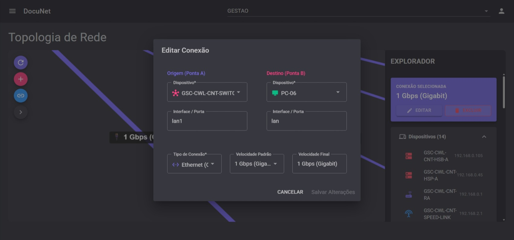

# 🌐 DocuNet - Documentação de Rede Inteligente


**DocuNet** é uma plataforma moderna e intuitiva de próxima geração para documentação e visualização de topologia de rede. Projetada para facilitar a gestão de infraestruturas complexas através de uma interface visual rica e interativa.

---

## ✨ Funcionalidades Principais

- **🗺️ Topologia Dinâmica:** Visualize sua infraestrutura em tempo real com mapas interativos e inteligentes.
- **🏢 Isolamento Multi-Org:** Gerencie múltiplas organizações com total separação de dados e segurança robusta.
- **🏗️ Editor In-Place:** Adicione, edite e remova dispositivos e conexões diretamente pelo mapa visual.
- **📱 Gestão de Ativos:** Controle detalhado de dispositivos, portas, IPs e especificações técnicas.
- **🔗 Monitoramento de Links:** Visualização clara de conexões entre ativos e estados de rede.
- **🔐 Segurança Integrada:** Sistema de autenticação e autorização completo com níveis de acesso.

---

## 📸 Demonstração Visual

| Vista Geral da Topologia | Gestão de Dispositivos |
| :---: | :---: |
|  |  |

| Edição Interativa | Lista de Conexões |
| :---: | :---: |
|  |  |

---

## 🛠️ Stack Tecnológica

- **Backend/Frontend:** ASP.NET Core 10 & Blazor Server (Interactive Mode)
- **UI Toolkit:** [MudBlazor](https://mudblazor.com/) (Componentes Material Design para Blazor)
- **ORM:** Entity Framework Core
- **Database:** SQLite (Leve e eficiente para documentação local/distribuída)
- **Logging:** Serilog
- **Identity:** Microsoft Identity para gestão de usuários e permissões

---

## 🚀 Como Começar

### Pré-requisitos
- [.NET 10.0 SDK](https://dotnet.microsoft.com/download/dotnet/10.0) instalada.
- Um editor como Visual Studio 2022 ou VS Code.

### Instalação

1. **Clone o repositório:**
   ```bash
   git clone https://github.com/kaua-alves-queiros/DocuNet.git
   cd DocuNet
   ```

2. **Restaure as dependências:**
   ```bash
   dotnet restore
   ```

3. **Execute a aplicação:**
   ```bash
   dotnet run --project DocuNet.Web
   ```

A aplicação estará disponível em `https://localhost:5001` ou `http://localhost:5000`.

---

## 👥 Contribuição

Contribuições são bem-vindas! Se você deseja reportar um bug, sugerir uma funcionalidade ou enviar um Pull Request, sinta-se à vontade para explorar o repositório.

1. Faça um Fork do projeto
2. Crie uma branch para sua Feature (`git checkout -b feature/NovaFeature`)
3. Commit suas mudanças (`git commit -m 'Add: Nova Feature'`)
4. Force o Push para a branch (`git push origin feature/NovaFeature`)
5. Abra um Pull Request

---

## 👨‍💻 Autor

Criado por **Kauã Alves**.

[](https://www.linkedin.com/in/kaua-a-queiros-c-silva-09956a21b/)
[](https://github.com/kaua-alves-queiros)

---

## 📄 Licença

Este projeto está sob a licença [MIT](LICENSE.txt).